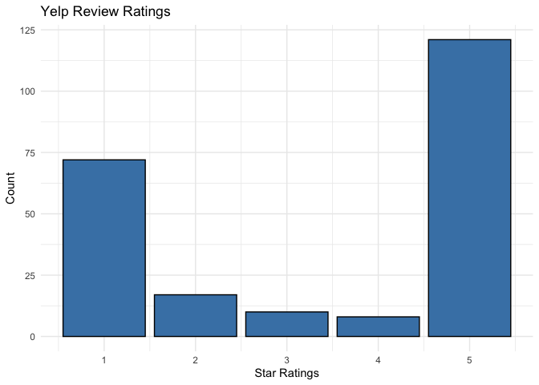

Mayo Clinic Yelp Review Text Analysis
================
RexManglicmot

-   <a href="#status-contnuing-working-document"
    id="toc-status-contnuing-working-document">Status: Contnuing Working
    document</a>
-   <a href="#introduction" id="toc-introduction">Introduction</a>
-   <a href="#webscraping-yelp-data"
    id="toc-webscraping-yelp-data">Webscraping Yelp Data</a>
-   <a href="#loading-the-libraries" id="toc-loading-the-libraries">Loading
    the Libraries</a>
-   <a href="#loading-the-data" id="toc-loading-the-data">Loading the
    Data</a>
-   <a href="#cleaning-the-data" id="toc-cleaning-the-data">Cleaning the
    Data</a>
-   <a href="#exploratory-data-analysis"
    id="toc-exploratory-data-analysis">Exploratory Data Analysis</a>
-   <a href="#wordcloud" id="toc-wordcloud">WordCloud</a>
-   <a href="#limitations" id="toc-limitations">Limitations</a>
-   <a href="#conclusions" id="toc-conclusions">Conclusions</a>
-   <a href="#inspiration-for-this-project"
    id="toc-inspiration-for-this-project">Inspiration for this project</a>

## Status: Contnuing Working document

Hi everyone. I’m continuing building my data analysis and R skills. As
such, I would love feedback to better improve this project via
<rexmanglicmot@gmail.com>. Any mistakes and misrepresentation of the
data are my own.

Things Need to Do/Questions:

-   Need to create wordclouds
-   Import and adjust dictionaries
-   Fix overall grammar
-   Need to List of the metrics in US News for evaluating hospitals and
    pick up where they left off or, pick up on what is missing in their
    analyses.
-   Need to find code to align left on the text column in the cleaning
    section
-   Learn how to create a US heat map code in the EDA section
-   learn how to remove file from Github (html document) but keep
    locally
-   look for a dictionary that has Male and Female first names and run
    it agaisnt data to see how many of each gender is present in the
    reviews
-   look for code how to highlight certain columns in a barchart (i.e.,
    ratings barchart below)
-   Create and cite sources of the benefits of wordclouds

## Introduction

<center>


</center>

What is the best hospital within the US? Which one is the nearest to me?
Where can find out what patients have to say about this XYZ hospital?
These questions are sample of many questions as Americans navigate the
maze of the US private healthcare hospital system. On average, health
care spending is \$12,530 per person in 2022, which is up from \$11,462
in 2019.[^1] With a total of 6,093 US hospitals[^2], it leaves many to
wonder which healthcare system they should put their lives and money on.
Unlike a single payer system, where the government covers majority of
healthcare needs for its citizens (i.e. Canada, UK, and Australia), the
US healthcare system is comprised of private and public conglomarate and
individual hosptal systems. Therefore, in the US, not all hospitals are
created equal as some are privately and publicized owned; some do well
versus some do not.

There is a need to rank such hospitals. Thus, every year U.S. News
publishes the best hospitals ranked within the U.S.[^3] Although the
list does not contain all the hospitals, but contained about 4500. The
top ranked hospital for 2022-23 is the Mayo Clinic based on U.S. News
methodology. To gain a better understanding why the Mayo Clinic is \#1
and to further build upon this study, I decided to use anothe method to
better understand and use a Text Analysis on comments made by Yelp
reviewers as a means.

Thus, this projects aims to understand user reviews through the Yelp
platform, which is aimed to provide reviews to many businesses,
including healthcare institutions (both private and public). By
undergoing this research, there are 3 objectives:

1.  Uncover hidden word-themes that reflect the true sentiments by
    patients that is also reproducible
2.  Provide a starting point for hospital C-suite to reflect some of the
    concerns patients have about their facility
3.  Provide an opportunity for hospitals on the bottom part of the US
    News list to reflect on their services to patients

By using text data, there are an array of methods to deploy.

This project is comprised of the following chapters:

1.  Webscraping Yelp Data
2.  Loading the Libraries
3.  Loading the Data
4.  Cleaning the Data
5.  Exploratory Data Analysis
6.  Word Cloud
7.  Positive and Negative Words
8.  Limitations
9.  Conclusion
10. Inspiration for this project

## Webscraping Yelp Data

Yelp data was scrapped on via the [Yelp](https://www.yelp.com/) website.
Within the search engine bar, I typed in *Mayo Clinic* and used the
first “business result to scrape the data as it’s location, Rochester
Minnesota matched on US News. Further, the business had
a”blue-checkmark” with “Claimed” indicating that the business was the
legitimate Mayo Clinic.

There were 228 reviews in total and the goal was to scrape all 228
reviews containing these 4 metrics:

1.  reviewer name
2.  reviewer location
3.  review rating
4.  review text

(I decided to exclude photos from the reviewers because of the scope of
this project to analyze text data.)

After various hours debugging the code and looking at html tags to
discern appropriate tags to scrape, I was able to obtain all reviews
within Yelp. Troubleshooting code included unintentionally scraping a
response from a Mayo Clinic official that accrued in more than the 228
reviews. A special acknowledgement to Samer Jijjazi for his YouTube
tutorial in learning how to scrape data from Yelp.[^4] Watching his
videos greatly helped me get the data needed to webscrape.

Below is the code used to scrape data. Mayo_Clinic.csv file is available
within the repository.

``` r
#load libraries
library(tidyverse)
library(rvest)

#create an object to store the webpage address
url <- 'https://www.yelp.com/biz/mayo-clinic-rochester-12?osq=Mayo+clinic'

#convert the url to an html object for R processing
webpage <- read_html(url)

#create object to know page number on the webpage
webpageNum <- webpage %>%
  html_elements(xpath = "//div[@class= ' border-color--default__09f24__NPAKY text-align--center__09f24__fYBGO']") %>%
  html_text() %>%
  str_extract('of.*') %>%
  str_remove('of ') %>%
  as.numeric()

#create a sequence to iterate for page number
webpageSeq <- seq(from = 0, to = (webpageNum * 10)-10, by = 10)

#store items into empty objects
reviewer_name_all = c()
reviewer_location_all = c()
review_rating_all = c()
review_text_all = c()

#create a for loop to get values throughout the 23 pages
for (i in webpageSeq) {
  #need to create an if statement because the 1st page web address
  if (i == 0) {
    webpage <- read_html(url)
    #need to create else because webpage has more content than 1st page web 
    #address
  } else {
    webpage <- read_html(paste0(url, '&start=', i))
  }
  
  #reviewer name
  reviewer_name <- webpage %>%
    #return elements that I specify via xpath method
    #xpath is useful for locating elements
    #// means to search within entire document
    #* means to return any of the elements
    # div means to search within document with the div tags
    html_elements(xpath = "//div[starts-with(@class,' user-passport')]") %>%
    #look within a tag within the previous element
    html_elements(xpath = ".//a[starts-with(@href, '/user_details')]") %>%
    html_text()
  
  #reviewer location
  reviewer_location <- webpage %>%
    #location is within the same div tag, so use same code
    html_elements(xpath = "//div[starts-with(@class,' user-passport')]") %>%
    #location is also located within the span tag
    html_elements(xpath = ".//span[@class= ' css-qgunke']") %>%
    html_text() %>%
    #remove "Location" 
    #pipe remaining values that are not "Location"
    .[. !='Location']
  
  #review rating
  review_rating <- webpage %>%
    html_elements(xpath = "//div[starts-with(@class, ' review')]") %>%
    #within div tag there is an aria-label
    #contains function to look for aria-label that has rating  
    html_elements(xpath = "(.//div[contains(@aria-label, 'star rating')])[1]")%>%
    #ratings are not text, so must use different method and specify which 
    #attribute to obtain
    html_attr('aria-label') %>%
    #remove star rating
    str_remove_all(' star rating') %>%
    #convert into a numeric
    as.numeric()
  
  #review text
  review_text <- webpage %>%
    html_elements(xpath = "//div[starts-with(@class, ' review')]") %>%
    #look throughout webpage with the p tag
    #to get the first comment and not worr about business comment,
    #need to put in brackets
    html_elements(xpath = "(.//p[starts-with(@class, 'comment')])[1]") %>%
    #html_elements(xpath = ".//span[starts-with(@class, ' raw')]") %>%
    html_text()
  
  #appending to appropriate objects
  reviewer_name_all = append(reviewer_name_all, reviewer_name)
  reviewer_location_all = append(reviewer_location_all, reviewer_location)
  review_rating_all = append(review_rating_all, review_rating)
  review_text_all = append(review_text_all, review_text)
  
}

#create a dataframe containing appended values
Mayo_Clinic <- data.frame('name' = reviewer_name_all,
                          'location' = reviewer_location_all,
                          'rating' = review_rating_all,
                          'text'= review_text_all)

#view csv file
#head(Mayo_Clinic)
```

## Loading the Libraries

``` r
#load libraries
#install.packages('tidyverse') #had to re-install for some reason on 11/12/22
#install.packages('ggraph') #had to re-install for some reason on 11/12/22
#install.packages('DT')
#install.packages('gt')

library(tidyverse)
library(tidytext)
library(widyr)
library(RColorBrewer)
library(wordcloud)
library(igraph)
library(ggraph)
library(gt)
```

## Loading the Data

``` r
#load Mayo Clinic data
data <- read.csv('Mayo_Clinic.csv')
```

## Cleaning the Data

Since the data is loaded, instead of using the function str, let’s
expand my R code competency by using different functions to view the
column names and the dimensions of the the data

``` r
#get the names of the variables
colnames(data)
```

    ## [1] "X"        "name"     "location" "rating"   "text"

``` r
#get the number of rows in the dataset
dim(data)
```

    ## [1] 228   5

Ok, we see that there is the X variable which indexes the observations.
Let’s get rid of that column and check it if worked.

``` r
#remove the X column
data <- data %>%
  select(-X)

#get the names other than the colnames funciton
names(data)
```

    ## [1] "name"     "location" "rating"   "text"

``` r
dim(data)
```

    ## [1] 228   4

Good. Now, let’s view the first few rows of the dataset using the head
function.

``` r
#View first rows of the observations of the data
head(data)
```

    ##         name          location rating
    ## 1  Stacey C.  Indianapolis, IN      5
    ## 2    Arin W.       Chicago, IL      1
    ## 3 Jessica S.   Kansas City, MO      5
    ## 4    Fran H. San Francisco, CA      1
    ## 5   Annie R.        Denver, CO      1
    ## 6    Bess L.  Laguna Beach, CA      1
    ##                                                                                                                                                                                                                                                                                                                                                                                                                                                                                                                                                                                                                                                                                                                                                                                                                                                                                                                                                                                                                                                                                                                                                                                                                                                                                                                                                                                                                                                                                                                                                                                                                                                                                                                                                                                                                                                                                                                                                                                                                                                                                                                                                                                                                                                                                                                                                                                                                                                                                                                                                                                                                                                                                                                                                                                                                                                                                                                                                                                                                                                                                                                                                                                                                                                                                                                                                                                                                                                                                                                                                                                                                                                                                                                                                                                                                                                                                                                                                                                                                             text
    ## 1                                                                                                                                                                                                                                                                                                                                                                                                                                                                                                                                                                                                                                                                                                                                                                                                                                                                                                                                                                                                                                                                                                                                                                                                                                                                                                                                                                                                                                                                                                                                                                                                                                                                                                                                                                                                                                                                                                                                                                                                                                                                                                                                                                                                                                                                                                                                                                                                                                                                                                                                                                                                                                                                                                                                                                                                                                                                                                                                                                                                                                                                                                                                                                                                                                                                                                                                                                 I only have good things to say about Mayo.  A family member was diagnosed by their  local doctor with a condition that required surgery to correct.  Several local doctors preform this surgery occasionally buy not routinely so we contacted Mayo where they have a specialist who focuses on this procedure and does over 300 a year.  We transmitted the records and tests electronically, had phone consultations, scheduled a week long visit.  All of the staff was professional, engaging, and seemed to honestly care about their job and the patients.  The cross coordination, communication, and care are so different than typically health care.
    ## 2                                                                                                                                                                                                                                                                                                                                                                                                                                                                                                                                                                                                                                                                                                                                                                                                                                                                                                                                                                                                                                                                                                                                                                                                                                                                                                                                                                                                                                                                                                                                                                                                                                                                                                                                                                                                                                                                                                                                                                                                                                                                                                                                                                                                                                                                                                                                                                                                                                                                                                                                                                                                                                                                                                                                                                                                                                                                                                                                                                                                                                                                                                                                                                                                                                                                                   The clinic might be great. I'll never know because they rejected me via form email that told me to "keep perusing local options" after making me jump through many hoops and having me sign upfor the patient portal which I now have no use for.  Also the person on the phone kept interrupting me and flatly saying "I need something that I can put in as a code".Both the phone calls I had were unsympathetic and frankly a waste. I'd bet money no actual person looked at my paperwork. Just a machine that scanned for keywords. It gets worse. My parents got in easy breezy for Executive Physicals which are extensive but only available to executives and their spouses. Which makes zero sense. (Hint: the answer is elitism)
    ## 3                                                                                                                                                                                                                                                                                                                                                                                                                                                                                                                                                                                                                                                                                                                                                                                                                                                                                                                                                                                                                                                                                                                                                                                                                                                                                                                                                                                                                                                                                                                                                                                                                                                                                                                                                                                                                                                                                                                                                                                                                                                                                                                                                                                                                                                                                                                                                                                                                                                                                                                                                                                                                                                                                                                                                                                                                                                                                                                                                                                                                                                                                                                                                                                                                                                                                                                                                                                                                                                                                                                                                                                                                                                                                                                                                                                                                                                It's hard to put into words the size of this place. Amazing medical center with top notch doctors, nurses, and all the support staff. A collaborative effort from all involved.
    ## 4                                                                                                                                                                                                                                                                                                                                                                                                                                                                                                                                                                                                                                                                                                                                                                                                                                                                                                                                                                                                                                                                                                                                                                                                                                                                                                                                                                                                                                                                                                                                                                                                                                                                                                                                                                                                                                                                                                                                                                                                                                                                                                                                                                                                                                                                                                                                                                                                                                                                                                                                                                                                                                                                                                                                                                                                                                                                                                                                                                                                                                                                                                                                                                                                                                                                                                                                                                                                                                                                                                                                                             Received a text saying I missed my appt with my provider. Problem is I haven't even been set up to see a provider. So I called and was not very happy with Missy in General Internal Medicine. A little kindness and an apology for the error, rather than insist it was a phone call from central that I failed to pick up, would have been sufficient. I asked why they didn't leave a VM? "Is there anything else you need?" was Missy's reply. Absolutely not.
    ## 5 I moved here for a surgery. I had a tumor on my adrenal gland, and they couldn't figure out what it was. These tumors are notoriously hard to diagnose. My endocrinologist, Dr. Naan, who is the head of the department, was disrespectful and didn't take my case seriously. The first time I saw her, we did nothing. As we were standing up to leave she tells me that 1/3 of tumors like mine are benign, and she says that like it's a good thing. I stopped and said that this means 2/3 are malignant, and she just says "yup" and continues walking out the door. I was in shock. I'm only 36 y.o., and I had been told previously that it was probably benign. I never thought a doctor, let alone a department head, would be that flippant about telling me I had a 2/3 chance of having cancer. Next session, I told her I was really stressed about that, and I had spent an hour w a friend talking about it. Dr Naan replied "uh oh, I hope you weren't drinking". So, apparently Mayo Clinic department heads think patients have to be drunk to be worried about having a 2/3 chance of cancer. She was beyond dehumanizing. My surgeon, Dr McKenzie, didn't do any education during our surgical consult pertaining to the surgical procedure, what I can expect to happen during surgery, or the risks of surgery. I wrote a review, that was supposed to be confidential, detailing the things he left out. The resident came to see me the day off the surgery and educated me on exactly the things I mentioned in my anonymous review, nothing more, nothing less. He didn't tell me I'd have a catheter placed inside me during the operation, and no one told me after either. I only found out bc I was urinating blood, and because of the pain. Neither my endocrinologist or surgeon made any plans to follow up with me after surgery to discuss what the mass is, and the surgeon wrote explicitly in his notes that a follow up visit was not needed....so no one had plans to follow up and tell me what the mass was. And they didn't. I had some questions that I messaged them, a resident called back to answer my questions, but he never mentioned what the mass was until I asked. Then he said he was going to bring it up. The tumor wasn't in the same place they thought it was, it was actually outside the adrenal gland, and the resident said the adrenal gland would have died anyway, if they had just resected the tumor and not the whole gland. However, the tumor was not even inside the adrenal gland. No one told me that either. I read it in a report, and I brought it up to the resident. The resident said the surgeon didn't bring it up because the surgeon could not differentiate between tumor and regular adrenal gland. This surgeon does many, many adrenal resections each year, he's regarded as highly skilled, and he's does do partial adrenalectomies...so how is it possible that this surgeon could not differentiate between normal adrenal gland and a tumor that's sitting outside but adjacent to the adrenal? The surgeon just didn't want to educate me on anything that a normal patient would want to know -surgery risks, surgery outcomes, etc. I really wanted just the tumor removed, and Dr Naan mentioned that she wasn't sure the tumor was inside the adrenal, but the surgeon never said anything about that. The resident said that no one could have known that the tumor was outside the gland. Between Dr Naan and Dr McKenzie, it's just more dehumanizing bs than I can take. This is hard enough, but add on doctors like them who obviously don't care about my case at all, and the process becomes exponentially worse. I cannot believe I moved out here, to try to get better care, and ended up with doctors like these two who have been so offensive and absent on my case. Choosing Mayo was a huge mistake, and I don't recommend them. Go somewhere else, anywhere else, where they treat people like humans.
    ## 6                                                                                                                                                                                                                                                                                                                                                                                                                                                                                                                                                                                                                                                                                                                                                                                                                                                                                                                                                                                                                                                                                                                                                                                                                                                                                                                                                                                                                                                                                                                                                                                                                                                                                                                                                                                                                                                                                                                                                                                                                                                                                                                                                                                                                                                                                                                                                                                                                                                                                                                                                                                                                                                                                                                                                                                                                                                                                                                                                                                                                                                                                                                                                                                                                                                                                                                                                                                                                                                                                                                                                                                                                                                                                                                         Seen by resident doctor  in emergency  room. As a retired  medical  professional the treatment  lacked  what I would expect from  a hospital which  claims  to be number 1 in the country.  I believe  that a person  treatment  wouldn't  be any different  at any teaching  hospital in the country.

``` r
#how many observations are in the text column
length(data$text)
```

    ## [1] 228

At first glance, we see that text column is empty except for the fifth
observation. we also confirm the count of number of observations in the
text column. However, we when slide the cursor to the right, we see that
character strings are aligned right (this is a default function of the
dataframe). Now, let’s do a left-align to make the dataset easier to
intepret.

``` r
#need to figure out how to align left on the text column
#wrong code below
#alignment(data, left = 'left')
```

Great, now let’s see if there are duplicates AND if there is more than
one reviewer in the dataset.

``` r
#check for duplicates
sum(duplicated(data))
```

    ## [1] 0

``` r
#quick check to see if reviewer_name appears more than once
data %>%
  count(name, sort = TRUE) %>%
  #let's arbitarailys see the first 10 rows as base comparison
  head(n=10)
```

    ##           name n
    ## 1  Courtney C. 2
    ## 2   Jessica D. 2
    ## 3      John M. 2
    ## 4  Michelle F. 2
    ## 5   Phillip H. 2
    ## 6         A S. 1
    ## 7     Aaron J. 1
    ## 8      Alan R. 1
    ## 9  Aleyysha A. 1
    ## 10  Alfonso E. 1

We see that there are no duplicates and 5 people gave a review twice, so
a total of 223 different observations.

In cleaning our data, let’s see if there are any NA values and which
columns.

``` r
#if any NA, then where in the dataset
which(is.na(data))
```

    ## integer(0)

``` r
#quick check to see and sum if any NA are in rating variable
sum(is.na(data))
```

    ## [1] 0

As a last round for checking our data, the ratings are scaled from 1 to
5, let’s check if there any numbers above and below

``` r
#quick check to see if below 1 OR above 5
any(data$rating > 5 | data$rating <1)
```

    ## [1] FALSE

``` r
#create functions
numbers_only <- function(x) !grepl("\\D", x)
letters_only <- function(x) !grepl("[^A-Za-z]", x)

#let's double check the ratings column
sum(numbers_only(data$rating))
```

    ## [1] 228

``` r
sum(letters_only(data$rating))
```

    ## [1] 0

Now, that the data is cleaned thoroughly, let’s explore the data.

## Exploratory Data Analysis

One of the first questions that came to mine was where these reviewers
lived. Are they local residents near the Mayo Clinic or are they
visting? I think answering this question could provide more detal about
the reviews. So, let’s take the location column and graph it in the
context of the US. But first, let’s create a new object for this data
exploration

``` r
data_map <- data
```

The next question is to undertand patient ratings. So, let’s take the a
summary of that.

``` r
#calculate summary statistics
summary(data$rating)
```

    ##    Min. 1st Qu.  Median    Mean 3rd Qu.    Max. 
    ##    1.00    1.00    5.00    3.39    5.00    5.00

Looking at the summary statistics we see that the median and the max of
the list is 5. What this means is that there are more of the 5 “ratings”
in the list than there are others. The best way to view this, is via the
barchart.

``` r
#create a barchart to count the values
ggplot(data, aes(x=rating)) +
  geom_bar(color='black', fill='steelblue') +
  scale_fill_brewer(palette="Dark2") +
  theme_minimal() +
  labs(title = 'Yelp Review Ratings',
        x = 'Star Ratings',
        y = 'Count')
```

<!-- -->

Great. We see visually that there are more 1 and 5 ratings than there
are 2, 3, or 4. What this means is that patients had extreme views of
the hospital (with respect to the ratings category); “good” and “not
good”, so to speak.

Let’s get the actual values of these counts by building a table.

``` r
#create dataframe to build stacked barchart
rating <- c(1,2,3,4,5)
total <- c((sum(data$rating == 1)),
           (sum(data$rating == 2)),
          (sum(data$rating == 3)),
          (sum(data$rating == 4)),
          (sum(data$rating == 5)))

#create a table of all the rating sums
table3 <-data.frame(rating, total)
print(table3)
```

    ##   rating total
    ## 1      1    72
    ## 2      2    17
    ## 3      3    10
    ## 4      4     8
    ## 5      5   121

Now we see that for the 1 rating there are 72 reviews and for the 5
rating there are 121 (about 80%). Numerically, it seems the hospital has
done relatively well.

What we can do for the next steps are to separate the 228 reviews into 3
sections; 1 rating, 5 rating, and overall rating and see what words are
associated within each. That would be interesting to figure out.

## WordCloud

WordClouds are used to illustrate common words about a subject (Mayo
Clinic in our case). Need to fill in more.

In order to make a wordcloud, we need to index each word within a given
sentence per reviwer into a separate observation for counting purposes.
As a result, the number of observations in our current dataset, 228,
will increase by alot.

Because meanings of an English sentence is an accumulation of words.
There are certain words that have no substantial meaning (filler words)
like for example, words like “the, a, an, of, etc.”, so we need to do a
bit of more data cleaning to make an effective wordcoud.

## Limitations

## Conclusions

## Inspiration for this project

[^1]: <https://www.chcf.org/publication/2022-edition-health-care-costs-101/>

[^2]: <https://www.aha.org/statistics/fast-facts-us-hospitals>

[^3]: <https://health.usnews.com/health-care/best-hospitals/articles/faq-how-and-why-we-rank-and-rate-hospitals>

[^4]: <https://www.youtube.com/watch?v=qyGYItbMKkM>
